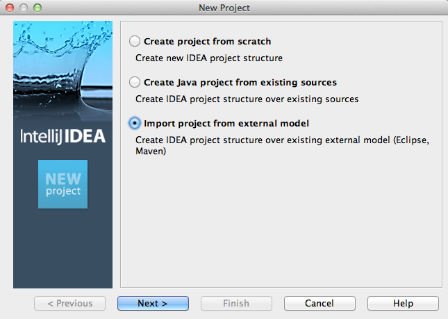
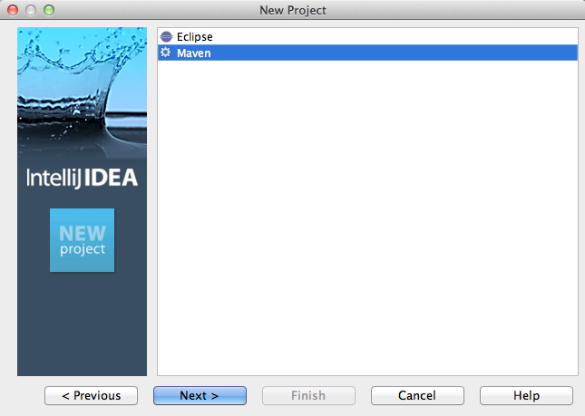
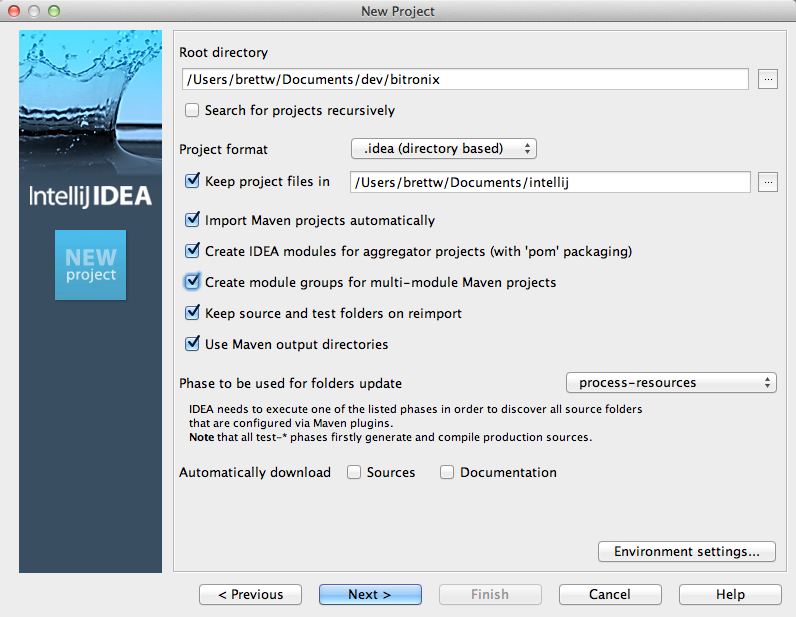
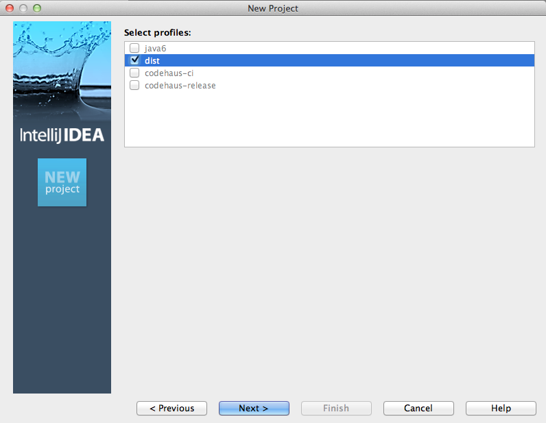
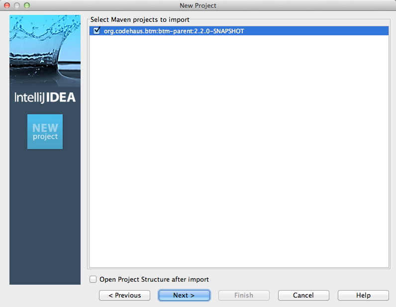
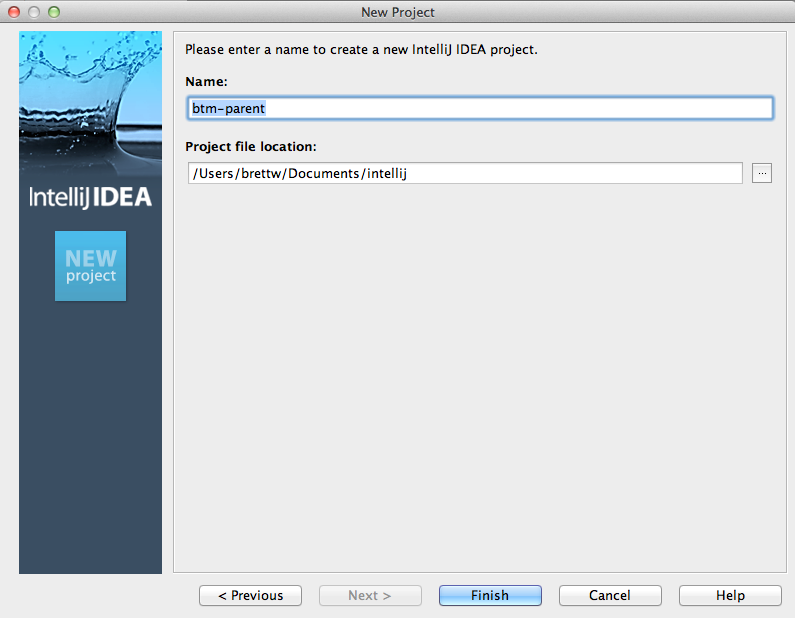
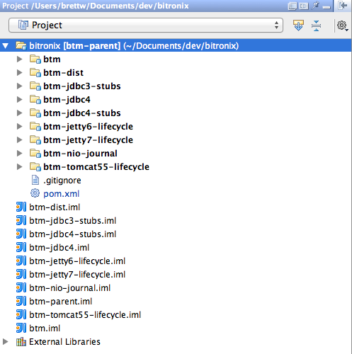
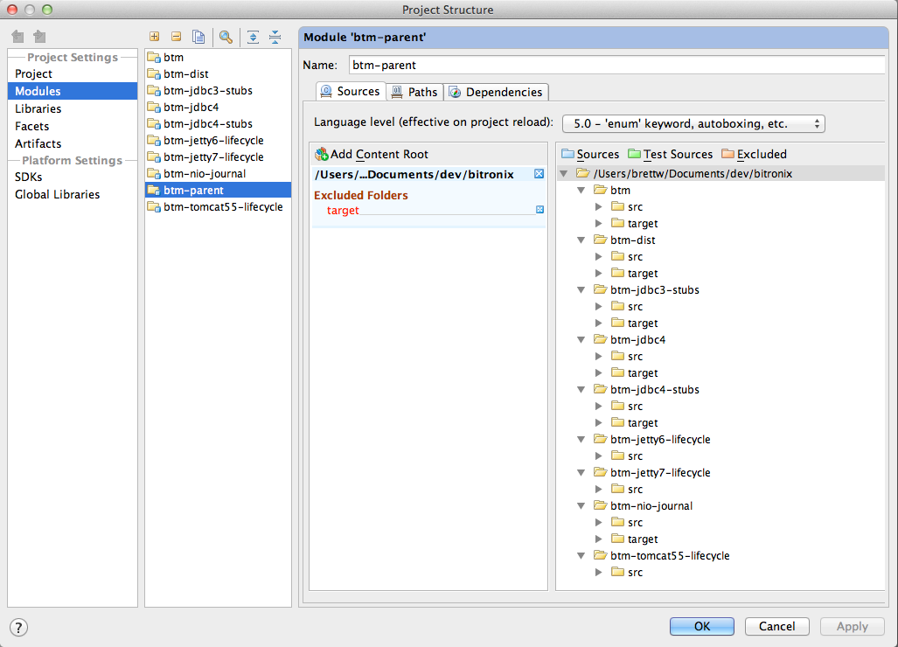
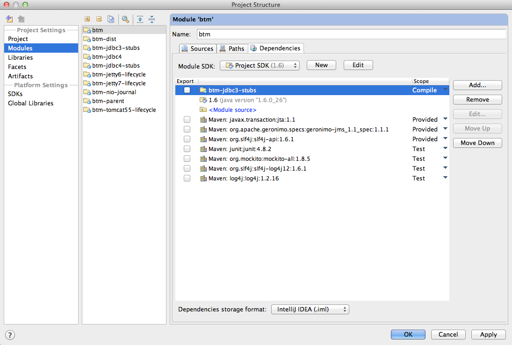
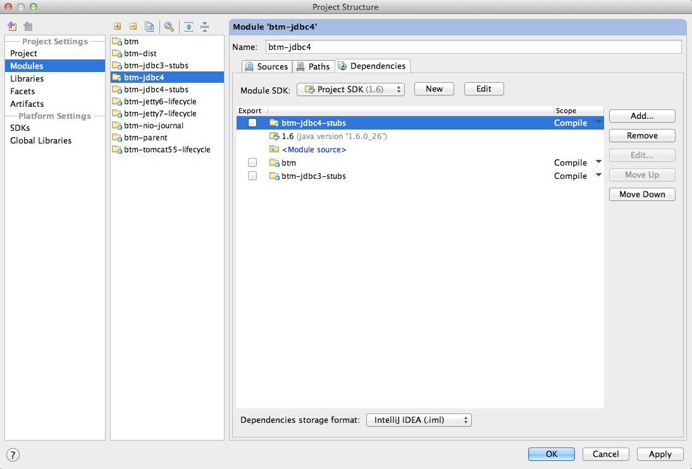

= Configuring IntelliJ IDE

Follow these steps to configure IntelliJ IDE for btm development.  These guide assumes you have already downloaded and built the source successfully with Maven.

****
Note: The following steps apply to the Bitronix 2.2 development branch, not prior releases.
****

== Step 1

Start the IntelliJ IDE, and select "New Project..." from the File menu.

Select the option "Import project from external model" (which includes Maven support). Click "Next".

Select the "Maven" option.  Click "Next".

* Set the "Root directory" to point to your GIT directory that contains the bitronix project.  In the example above, "/Users/brettw/Documents/dev/bitronix"
* Select the checkbox to keep your project files in a separate directory, and select a directory.  In the example above, "/Users/brettw/Documents/intellij".
* Select the checkbox to "Import Maven projects automatically".
* Select the checkbox to "Create module groups for multi-module Maven projects".
* Click "Next".

Select the 'dist' profile.  Click "Next".

Check to make sure the bitronix project shows up, and is selected.  Click "Next".

The defaults should be fine here, just click "Finish".
Your project tree should now look like this:

== Step 2
Now we're going to setup the module paths so that IntelliJ can build with both JDBC3 and JDBC4 at the same time.
Right-click on the bitronix project in the project tree, and choose "Open Module Settings" from the menu.  A window like this should open:

Now, perform these steps for the "btm" module:

- Select the "btm" module in the second pane from the left.
- Click on the "Dependencies" tab for the btm module.
- Select the "btm-jdbc3-stubs" dependency, and move it up, above the Java VM dependency ("1.6 (java version 1.6.0_26)" in the screenshot, possibly "1.5" in your environment).
- The result should look like this:

In IntelliJ, dependencies that appear after the JDK are added to the classpath, and dependencies that appear before the JDK are added to the bootclasspath.
Now, perform these steps for the "btm-jdbc4" module:

- Select the "btm-jdbc4" module in the second pane from the left.
- Click on the "Dependencies" tab for the btm-jdbc4 module.
- Select the "btm-jdbc4-stubs" dependency, and move it up, above the Java VM dependency ("1.6 (java version 1.6.0_26)" in the screenshot, possibly "1.5" in your environment).
- The result should look like this:

Ok, you're done!  Now, click "OK" to dismiss the module settings dialog.

== Step 3

Click on the "Build" menu, and select "Rebuild Project".  The projects should now build without error.

*Happy developing!  The Bitronix Team welcomes your contribution.*

